# bamazon
CLI based online shopping tool

### Bamazon Customer

Customers can view products, view their purchases, or quit.

View Products:

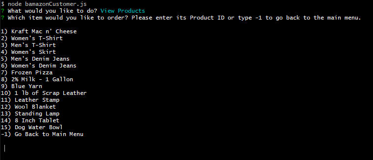

Select a product to purchase:

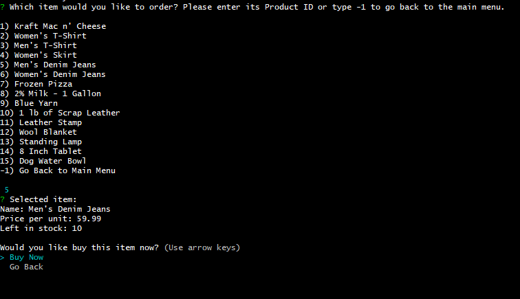

Enter quantity to purchase:

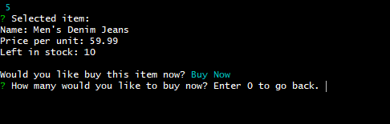

Purchase confirmation:

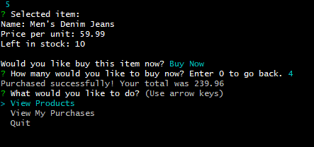

Customer purchases view:

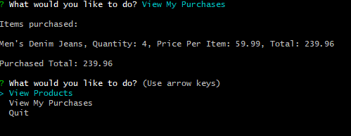

### Bamazon Manager

Managers can view products, view products that are low in stock, add to the inventory, add new products, and quit.

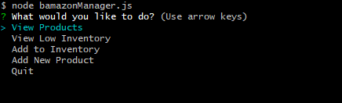

View Products:

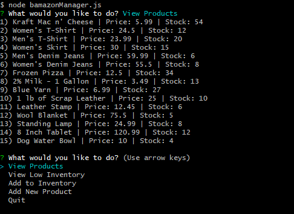

View Low Inventory:

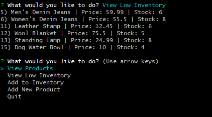

Add to Inventory:

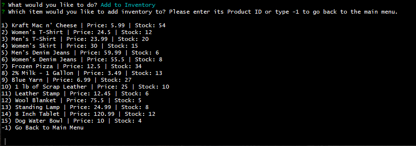

Indicate inventory quantity to add:

Add to inventory confirmation:

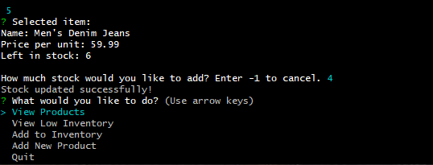

Add a new product:

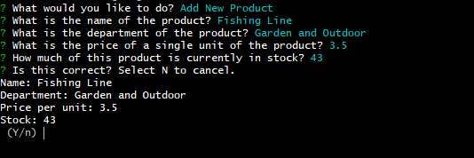

New product confirmation:

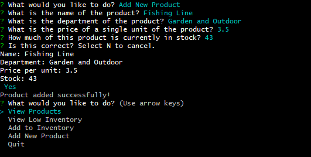
